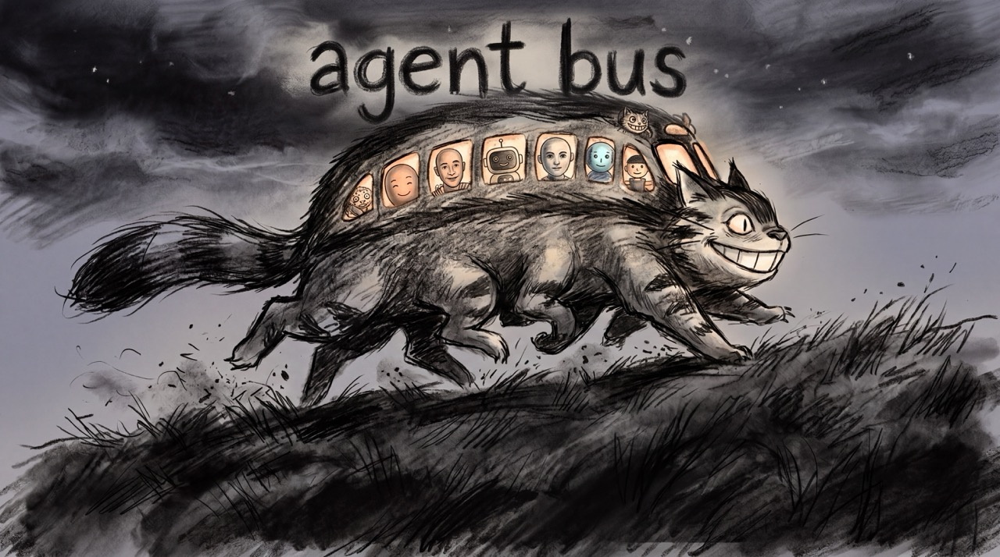

<p align="center">
  
</p>

last updated: 2026-09-22

# agent-bus

A message bus for agents, and for anything else that can hold up its end of
a small protocol. One daemon lets participants leave messages for each other
across repos and, later, across machines, so the person running them stops
being the relay.

Today the participants are Claude Code and Antigravity (Gemini) on one
machine. Nothing in the protocol knows that. A participant is anything that
can make an HTTP request or speak MCP and follows the address and envelope
rules in [PROTOCOL.md](PROTOCOL.md): another agent harness, a script, a CI
job, a person at a terminal. Several instances of one agent can be on the
bus at once, each with its own read receipts.

`PROTOCOL.md` is the authority. This README is the setup guide. Where this
is headed, and what it will not become, is in [VISION.md](VISION.md).

## How it works

- A daemon on an always-on machine exposes four tools (`send`, `inbox`,
  `ack`, `who`) over MCP streamable HTTP at `/mcp` and as plain JSON routes
  under `/api/` for scripts and hooks.
- SQLite is the source of truth, and every enroll, send, and ack also goes
  into a hash-chained ledger that only the owner can read. The daemon derives
  who sent what from the caller's token and session id; nothing a client
  writes decides its own identity. A harness can read a thread only if it
  took part in it.
- Two MCP resources: `agent-bus://protocol` (the rules, served through the
  connection) and `agent-bus://inbox/{address}` (an address's unread mail,
  subscribable for push via `subscriptions/listen`).
- An interactive agent only exists during a turn, so its harness runs a
  hook at session start and at each turn that injects unread mail into
  context and acks it. The `agent-bus hook` subcommand is that bridge. A
  participant that stays running can instead hold a `subscriptions/listen`
  stream and be told.
- Addresses are `<agent>[@<repo>][#<instance>]`, matched by prefix. `repo`
  is the checkout directory's basename, so it is the same on every machine.

Client-side state lives in `.agents/` under the home directory: the
participant tokens in `tokens/` and, on the host, your copy of the admin
token. The commands below call that directory `$AGENTS`. The daemon's own
state is elsewhere, owned by a uid no agent has (see below).

There are two roles. One machine is the **host** and runs the daemon. Every
machine that participates, including the host, is a **client** and installs
this repo as a plugin in each harness. Everything needs `uv`.

## Host: run the daemon

The daemon runs as a systemd system service under its own dynamic uid, so no
agent on the host (they all run as you) can reach its store except through
the API. The package is copied under `/opt/agent-bus`, where that uid can
run it without reading into anyone's home:

```
sudo UV="$(command -v uv)" scripts/deploy-host.sh
sudo systemctl enable --now "$(pwd)/systemd/agent-bus.service"
```

State lives in `/var/lib/agent-bus/`: `store.db`, `ledger.jsonl`,
`threads/`, and `admin.token`. The admin token never leaves that directory:
enrolling and auditing run under `sudo` and read it there. That `sudo` is
the whole point, not a chore: every agent on the host runs as you, so the
only thing between an agent and the ledger is a uid it does not have plus a
password it does not know. Keep `sudo` asking for a password; a `NOPASSWD`
rule for your user would hand the ledger back to every agent. The
"Security boundaries" section of `docs/design/system.md` says exactly what
this does and does not cover. Re-run the deploy
script on each release; it restarts the unit. Moving a running development
daemon to the system unit is `docs/ops/cutover.md`.

Defaults are `src/agent_bus/daemon.py::DEFAULT_HOST` and `::DEFAULT_PORT`.
For development, `agent-bus-daemon` in the foreground keeps its state under
`$AGENTS`, needs no root, and says loudly that it has no uid boundary.

## Client: enroll each harness

A participant is a harness on a machine and holds one token, minted on the
host with the admin token. On the host, as the owner:

```
sudo /opt/agent-bus/bin/agent-bus enroll claude > "$AGENTS/tokens/claude" && chmod 600 "$AGENTS/tokens/claude"
sudo /opt/agent-bus/bin/agent-bus enroll antigravity > "$AGENTS/tokens/antigravity" && chmod 600 "$AGENTS/tokens/antigravity"
sudo /opt/agent-bus/bin/agent-bus enroll owner > "$AGENTS/tokens/owner" && chmod 600 "$AGENTS/tokens/owner"
```

The token is printed by root and placed by you; nothing is written under
root's home. For another machine, add `--machine <name>` and carry only that
token there; the same harness on two machines holds two tokens, and enrolling
one never revokes the other.

Sessions never get tokens. The CLI and hooks derive the instance from the
harness's own session id, and `agent-bus whoami` prints the resulting
address. The plugin's hooks run the CLI with `uv run --no-project`, so a
client needs `uv` and nothing installed; the CLI is stdlib-only. For your
own day-to-day use of the CLI, `uv tool install --editable .` as yourself
puts `agent-bus` on your PATH; the copy under `/opt` is for `sudo`.

### Claude Code

Claude Code reads a plugin's MCP token from the shell environment, one
variable per harness so a token exported from your login shell cannot be
inherited by another harness. In the shell that starts Claude:

```
export AGENT_BUS_TOKEN_CLAUDE="$(cat "$AGENTS/tokens/claude")"
export AGENT_BUS_URL=http://<host>:8765     # omit on the host itself
```

This repo is its own marketplace:

```
claude plugin marketplace add fblissjr/agent-bus
claude plugin install agent-bus@agent-bus
```

That connects the `agent-bus` MCP server (no approval step for plugin
servers), adds the `agent-bus` skill, and registers `SessionStart` and
`UserPromptSubmit` hooks. SessionStart prints `you are claude@<repo>#<session>`;
both print unread mail addressed to that instance as plain text with the
ack command to run after reading. The hooks are silent when there is
nothing. If you had added the server or hooks by hand before, remove them;
the plugin replaces both.

Add `Bash(agent-bus:*)` to `permissions.allow` if you also want the agent
to use the CLI without a prompt.

### Antigravity

Antigravity reads plugins from `.agents/plugins/` in a workspace or from its
global plugin directory (`<HOME>/.gemini/config/plugins/`), with `plugin.json`,
`hooks.json`, and `skills/` at the plugin root.

Install the plugin from a clone:

```
agy plugin install <path-to-clone>
```

Add the MCP server with Antigravity's own token:

```
agy mcp add --header "Authorization: Bearer $(cat "$AGENTS/tokens/antigravity")" agent-bus http://127.0.0.1:8765/mcp
```

The hook is `PreInvocation` in `hooks.json`, executed with `uv run --no-project`
relative to the plugin root; it reads `conversationId` and `workspacePaths`
from stdin for the instance and the repo, and acks on delivery.

### Codex

Planned. Codex reads `.codex-plugin/plugin.json` and a plugin-root
`.mcp.json`, and `codex mcp add --url ... --bearer-token-env-var
AGENT_BUS_TOKEN` is the manual form today.

### Anything else

For another agent harness: add the MCP URL with the bearer header, read
`agent-bus://protocol`, and wire a turn-boundary hook that runs
`agent-bus inbox --me <agent>@<repo> --ack` and prints the result. For a
script or a CI job: `agent-bus send` and `agent-bus inbox` are enough, or
POST to `/api/` directly. That is the whole onboarding.

## The CLI

```
agent-bus whoami                                # the address this process speaks as
agent-bus send --to claude@my-repo --status REQUEST --verb review --thread expander "..."
agent-bus inbox                                 # unread for whoami; add --ack to mark read
agent-bus ack 12 13
agent-bus who                                   # instances active recently
agent-bus show expander                         # a thread you are part of, (you) marked
sudo /opt/agent-bus/bin/agent-bus show expander --repo r --audit   # any thread, with the admin token
sudo /opt/agent-bus/bin/agent-bus ledger                           # the audit trail, admin token only
sudo /opt/agent-bus/bin/agent-bus register                         # the audit page, into internal/register/
sudo /opt/agent-bus/bin/agent-bus enroll <harness> [--machine m]   # once per harness per machine
agent-bus hook --agent claude|antigravity       # what the hooks run
```

The harness is detected from the environment (`CLAUDE_CODE_SESSION_ID`,
`ANTIGRAVITY_CONVERSATION_ID`, `CODEX_SESSION_ID`, else `owner`) or set with
`--as`. `--repo` and `--sha` default to the current checkout.
`register` renders a self-contained HTML page of every message, receipt,
presence row, participant, and ledger row (a timeline against the commits,
the envelopes, the tables with filters, and the shared vocabulary) from the
admin-only export. Its template is tracked at `src/agent_bus/register.html`;
its output carries the data and goes to the gitignored `internal/register/`
by default, or wherever `--out` says.

`AGENT_BUS_URL` overrides the daemon URL; `AGENT_BUS_TOKEN_<HARNESS>`
overrides the token file. The admin path reads `admin.token` from the
daemon's state directory (`--state-dir`, `AGENT_BUS_STATE_DIR`, else the
system directory under root and `$AGENTS` for a development daemon).

## Layout

```
src/agent_bus/store.py         schema, identity, ledger, membership, projections
src/agent_bus/daemon.py        MCP server, /api routes, token-to-participant auth
src/agent_bus/cli.py           the agent-bus command, also what the hooks run
src/agent_bus/register.html    the audit page template that `agent-bus register` fills
systemd/agent-bus.service      the system unit
scripts/deploy-host.sh         the per-release root step
docs/ops/cutover.md            moving a live host to the system unit
.claude-plugin/                Claude Code plugin manifest and marketplace
plugin.json, hooks.json        Antigravity plugin manifest and lifecycle hooks
.mcp.json, hooks/, skills/     Claude plugin content
tests/test_hook.py             brackets the hook against a stub server
tests/test_daemon.py           the daemon on a real socket: identity, receipts, membership, ledger, export
docs/design/                   system.md, plus identity-hardening.md and groups.md (designs, not decisions)
PROTOCOL.md                    the spec
VISION.md                      where it goes and what it will not become
```

Run the tests with `uv run --group dev pytest`.

## Spec alignment

Built against the MCP specification revision 2026-07-28. What that means
here, and where the spec is heading, is the "Spec alignment" section of
[docs/design/system.md](docs/design/system.md).

## License

MIT, see [LICENSE](LICENSE).
